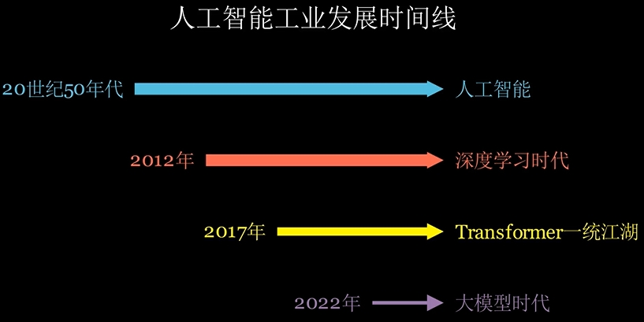
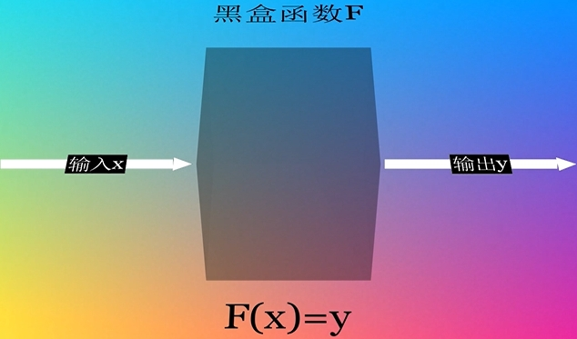
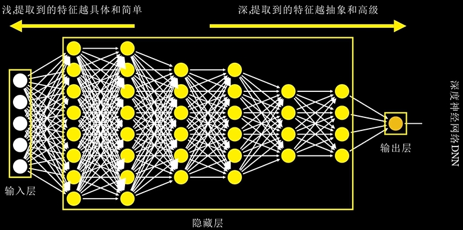
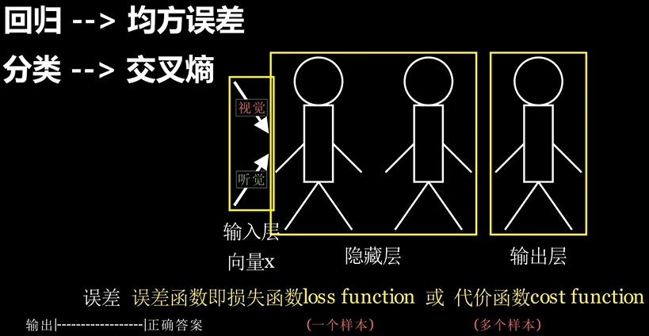
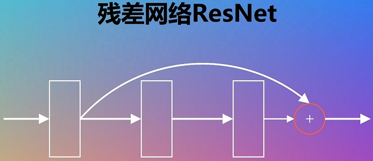

关于机器学习，深度学习，人工智能的基本概念我相信大家多多少少都听过，标准定义没什么好说的，我会从工业发展的时间角度对他们的关系和相关关键概念进行梳理。其实，20世纪五六十年代就有了这些概念，2012年往前，企业里的算法工程师都还说的是机器学习工程师，大家用的可能是逻辑回归，决策树，支持向量机SVM，贝叶斯，神经网络等之类的算法。

什么是**算法**？算法就跟任何系统一样，接受输入x，经过简单的或者非常复杂的数学计算之后得到y，这个简单的或者非常复杂的数学计算过程可以先看成一个黑盒，统概括为一个函数F，数学表达式就是F(x)=y。洗衣机接收衣服，水，洗衣粉的输入，经过一些列的疯狂计算，输出干净的衣服。现在最热的ChatGPT，Kimi也同样可以看作是一个黑盒函数F，接受用户输入，经过F函数计算后输出答案，就是这个意思。

重点来说**神经网络**，白色的是整个网络的原始输入，输入会给到中间第一个黄色的隐藏层，第一个隐藏层的输出又会作为第二个隐藏层的输入，第二个隐藏层的输出又会作为最后一层的输入，最后一层蓝色的即输出层。除了白色输入层，后面的每一个圆圈加上它的输入输出都算是一个**神经元**，神经元是构成神经网络的基础单元，一个神经元可以接收多个**输入**，画的每一个线条代表的是对应输入x的**权重**值w，如果这些输入x是一个个有不同特点的美女，最终的**输出**是你是否愉悦，那权重w为0就表示这个美女跟你没任何关系，她对你不起作用，权重越正向大表示你和美女越对眼，她能让你很愉悦，是你的心上人，越负向小表示这个美女越是你反感的类型。顺便说一下，我们说llama3.1大模型有405B参数量，说的一般就是这些w的数量。这多个输入用数学方式表示在一起就可以称为一个**输入向量**，那同样的也就有**权重向量**。神经元的计算方式是把这两个向量进行相乘，专业叫法为**内积**或**点积**，内积结果是一个数值，也称为**标量**，标量再经过一个**激活函数**得到这个神经元的输出，激活函数有很多种，常见的有**Sigmoid**，**tanH**，**ReLu**，为什么叫激活函数，因为它可以起到将这个神经元激活或者抑制的作用，比如当使用Sigmoid函数时，内积结果越大，这个神经元的输出越接近1，就起到激活作用，内积结果越负向小，输出越接近0，就起到抑制作用。想想，简单的复杂的控制系统不都是由多个这些激活抑制的逻辑开关组合而成的么。

多个神经元一层一层的组装在一起，就成了神经网络，除了输入和输出层，中间的**隐藏层**越多，越靠近输出层，模型深度也就越深越，能够提取的**特征模式**也越来越抽象和高级，就像你小的时候爸爸出差回家了妈妈让你早点睡，你只知道早点睡，长大了脑神经连接深了才能提取到更深层次的含义，这种多个隐藏层的神经网络就叫**深度神经网络DNN**。

这里还要补充一些概念，我们都玩过猜成语游戏，脑袋里的电影回放一下，有3位在深山老林里住了20年的学习能力很强的白痴同学跑出来在裁判的指引下做游戏，第一个同学从裁判那获得四字成语：鸡飞狗跳后开始按照他的理解做动作表演给第二个同学看，第二个同学收到来自第一个同学的输入后，按照他的理解再表演给第三个同学。第三个同学看到后猜是猪狗不如。这是一个很好的神经网络的比喻，前2个同学都属于中间隐藏层，第3个同学属于输出层，可以把第一个同学接收的视觉和听觉数据看着输入层，视觉和耳语听觉的输入，就是这个网络的原始输入向量x，因为有视觉和听觉多个方面的信息，所以它是多个值，是一个向量，隐藏层同学理解到的信息就是他们提取到的特征，这些特征综合起来通过大脑的激活函数思考后去激活他去做一系列动作向后传递，第三个同学理解一通之后给定输出猪狗不如，这个从输入一层一层计算最后得到输出的过程就是**前向传播**。但最后的输出跟正确答案是有误差的，衡量输出与正确答案之间的误差函数就是**损失函数loss function**，一般也叫**代价函数cost function**，如果一定要深究他们之间的差异，那loss function是一次输入样本的输出与正确答案的误差，cost function则是多次一起评估。这里提到样本的概念很好理解，做一次这样的成语游戏就算是一个样本。

衡量误差的损失函数有很多种，工业界使用最多的，衡量分类问题误差的是**交叉熵损失**，衡量回归问题的是**均方误差**。判断一个图像是猫还是狗就是**分类问题**，预测北京2025年的房价，这种预测一个具体的数值就是**回归问题**。现在很明显，要想游戏玩赢别人，就要想办法一步一步的缩小最后的输出与正确答案的误差，也就叫要**最小化损失函数**。怎么去缩小差距呢，同学想了个办法，第三个同学每次知道自己的输出与正确答案的差距后，就会跟第二个同学交流，如果你理解是狗，就这样做动作，如果你理解是鸡，就这样做动作。第二个同学知道后也跟第一个同学做类似的沟通，第一个同学知道后，噢，这个视觉和听觉的样子是要激活这个动作，像这样根据损失误差来向前一层层传递误差进行优化的过程就叫**反向传播Back Propagation**，简称**BP**，每位同学下一步的动作优化方向就是**梯度**，数学运算中这些梯度都是通过求导得到的，这种优化方法就是**梯度下降**算法，就是通过这个算法达到一步步优化更新w参数的目的。3位同学如此反复的去猜一个又一个词的过程就是**学习**或者说**训练**的过程。在前几次训练中，由于还没有经过几次训练，3位同学还不怎么知道怎样的动作是表示什么，最后的答案也猜不对，就叫**欠拟合**，意思是学习得还不够，样本见得不够多。如果看了一些样本后，同学们终于能猜对鸡飞狗跳，但稍微变换一下变成鸡犬不宁就又完全不会了，这就叫**过拟合**，叫**泛化能力**弱。反之，如果再又经过几万次甚至几百万次的训练，鸡犬不宁也会，打草惊蛇会，画蛇添足会，连从没见过的大龙，龙行天下都会，这就叫泛化能力强，学到**潜在的知识表示**了。进一步，每次都给答案让他去训练的方式就叫**有监督**的训练，反之就叫**无监督**的训练。其实神经网络跟人脑的学习真的挺像的，想想人一生下来也并不认识猫狗，但随着见过一些猫狗，以及听到或看到一些描述，就慢慢学到了什么样的动物就是猫狗，即使来一只从来见过的阿拉斯加犬，也会知道这是一只狗而不是猫，原因就在于相关脑神经已经建立了连接，已经提取到了猫狗的一些抽象特征高级特征，但你要一个孩子准确说出到底猫狗有什么样的特征，她基本是说不出来的，神经网络也一样，中间隐层学到的特征到底是什么，说不清道不明，可解释性很差。

说回来，深度神经网络DNN也有一些变种，比如擅长提取图像特征的**卷积神经网络CNN**，提取序列特征的**循环神经网络RNN**。2012年之前，大多企业里玩的神经网络可能还只有输入层，一个隐藏层，输出层三层。但2012年，由这3位大神设计的深度卷积神经网络**AlexNet**在视觉大赛中一炮而红，神经网络开始设计得越来越深越来越大，参数量越来越多，而因此工业界开始全面进入**深度学习**应用时代。当网络设计得越来越深，就容易出现一个问题，**梯度消失**，想想那3个同学玩的游戏，如果中间再加上十几个，反向传播时的一层一层的优化梯度方向岂不就是会慢慢消失学不会东西了嘛。解决梯度消失问题有很多方法，其中非常重要的，中国大神何恺明等人发明的**残差网络ResNet**就是其中一种，很简单，更改下游戏规则，除了可以按照正常的流程走，第一个同学也可以跨过第二个同学直接向第三位同学做表演，残差网络实际就是**残差连接**，即前面的可以根据实际需要来跨过中间一些网络层直接连到后面的层，反向传播时，优化梯度方向既可以传播至中间的网络让其学到一些知识，也可以直接传播到更前面的层，这样整个网络就能更快的提取到有用的特征，学习到知识，这是一种非常重要的设计思想，现在一统江湖的**Transformer**内部就用到了残差连接。

到2017年，深度网络架构transformer横空出世，一直到今天，transformer都是一统江湖的状态，文本，语音，图像，视频，sota模型都是transformer架构，当然也包括ChatGPT。

2022年，随着OpenAI的ChatGPT发布，正式进入大模型时代！

我们可以把2012年至今称为深度学习时代，2017年至今是transformer一统天下，2022年至今是大模型时代全民AI时代。