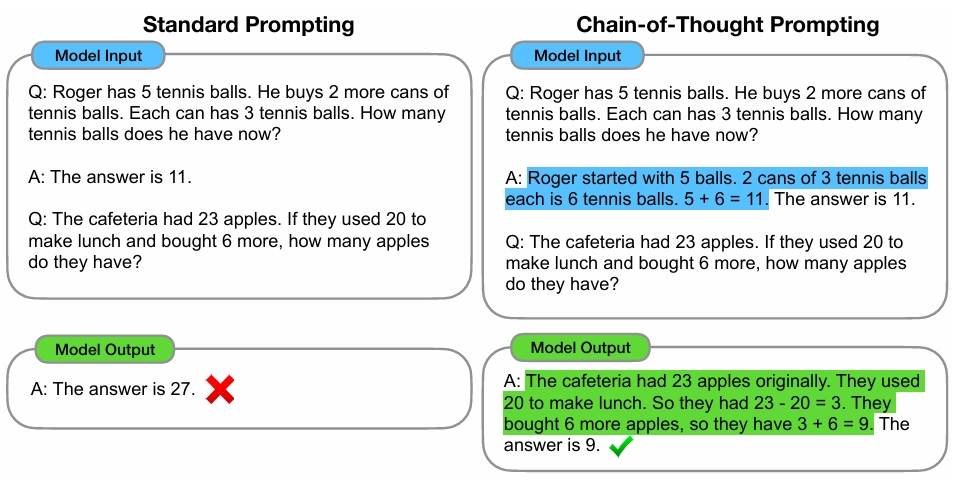

> 视频地址：

### 一、OpenAI prompt经验准则参考

参考：[Best practices for prompt engineering with the OpenAI API | OpenAI Help Center](https://help.openai.com/en/articles/6654000-best-practices-for-prompt-engineering-with-the-openai-api)

##### 1. 使用最新的模型

```
GPT-3，GPT-3.5，GPT-3.5-turbo，GPT-4，GPT-4-turbo，GPT-4o，GPT-4o-mini
```

##### 2. 把指令放在提示的开头并且用###或"""来分隔指令和上下文

低效的❌：

```plain
将下面的文本总结为最重要的要点列表。

{此处输入文本}
```

更好的✔️：

```plain
将下面的文本总结为最重要的要点列表。

文本："""{此处输入文本}
"""
```

##### 3. 尽可能具体地，详细地描述预期的背景、结果、长度、格式、风格等

低效的❌：

```plain
写一首关于OpenAI的诗。
```

更好的✔️：

```plain
以{某著名诗人}的风格写一首关于OpenAI的鼓舞人心的小诗，重点关注最近的DALL-E产品发布(DALL-E是一个文本到图像的ML模型)。
```

##### 4. 通过示例阐明所需的输出格式

低效的❌：

```plain
提取下面文本中提到的实体。提取以下4种实体类型:公司名称，人名，特定主题和主题。

文本：{文本}
```

更好的✔️：

```plain
提取下文中提到的重要实体。首先提取所有公司名称，然后提取所有人名，然后提取适合内容的特定主题，最后提取总体主题。

预期格式：
公司名称：<逗号分隔的公司名列表>
人名：-||-
特定主题：-||-
总体主题：-||-

文本：{文本}
```

##### 5. 从零样本开始，然后少样本，如果都不起作用就做微调

零样本（0-shot）✔️：

```plain
从下面的文本中提取关键字。

文本：{文本}

关键字：
```

少样本（few-shot）✔️：

```plain
从下面的文本中提取关键字。

文本1：Stripe提供了一些api, web开发者可以使用这些api将支付处理集成到他们的网站和移动应用程序中。
关键字1：Stripe，支付处理，api，web开发者，网站，移动应用程序
文本2：OpenAI训练了非常擅长理解和生成文本的尖端语言模型。我们的API提供了对这些模型的访问，并且可以用于解决几乎涉及处理语言的任何任务。
关键字2：OpenAI，语言模型，文本处理，API

文本：{文本}
```

##### 6. 减少空洞的和不精确的描述

低效的❌：

```plain
这个产品的描述应该相当短，只有几句话，不要太多。
```

更好的✔️：

```plain
请用3到5句话来描述这个产品
```

##### 7. 不要只告诉他不做什么，还要告诉他要做什么

低效的❌：

```plain
以下是一个Agent和客户之间的对话。不要问用户名和密码。不要重复。

客户：我不能登录我的账号。
Agent：
```

更好的✔️：

```plain
以下是一个Agent和客户之间的对话。这个Agent会尝试着诊断问题并建议解决方案，同时要避免询问任何与PII相关的问题。不要询问用户名和密码，而是让用户参考帮助文章 www.samplewebsite.com/help/faq

客户：我不能登录我的账号。
Agent：
```

##### 8. 对于代码生成任务——使用“引导词”将模型推向特定的模式

低效的❌：

```plain
#写一个简单的Python函数
#给我一个英里单位数字
#将英里转换为千米
```

更好的✔️：

```plain
#写一个简单的Python函数
#给我一个英里单位数字
#将英里转换为千米

import
```

### 二 更多经验准则

##### 9. CoT思维链



论文参考：[Chain-of-Thought Prompting Elicits Reasoning in Large Language Models](https://arxiv.org/pdf/2201.11903)

###### CoT实现方式1：以咒语方式提示模型：“让我们分步骤思考”，“Let's think step by step”

###### CoT实现方式2：通过在小样本中以分步骤思考并解决问题的方式提示模型

##### 10. 结构化提示模版

将信息分门别类的清晰的给出来，阅读理解题 VS 配对题

低效的❌：

```plain
写一部面向小学三年级学生标题为小芋头的幸福生活的千字左右微型小说，故事要完整，精彩动人，用词优美，善用比喻拟人等修辞手法。小说的主人公有小芋头，小芋头爸爸和妈妈，数学王老师，朋友小馒头。故事讲述了小芋头开学第一天裤子穿反了的糗事。
```

更好的✔️：

```plain
写一部微型小说。
-读者：小学三年级学生
-标题：小芋头的幸福生活
-主人公：小芋头，小芋头爸爸和妈妈，数学王老师，朋友小馒头
-故事概要：小芋头的开学第一天的糗事——裤子穿反了。
-要求：一千字左右，故事完整，精彩动人，用词优美，善用比喻拟人等修辞手法。
```

### 三 万能prompt模式

``````plain
RGBR = Role（角色）+ Goal（目标）+ Background（背景）+ Requirement（要求）
``````

改写前❌：

```plain
写一部面向小学三年级学生标题为小芋头的幸福生活的千字左右微型小说，故事要完整，精彩动人，用词优美，善用比喻拟人等修辞手法。小说的主人公有小芋头，小芋头爸爸和妈妈，数学王老师，朋友小馒头。故事讲述了小芋头开学第一天裤子穿反了的糗事。
```

改写后✔️：

```plain
-Role：你是一名出色的微型小说作家，特别擅长撰写小学生题材的小说。
-Goal：请写一部题为《小芋头的幸福生活》的微型小说
-Background: 
	-读者：小学三年级学生
    -主人公：小芋头，小芋头爸爸和妈妈，数学王老师，朋友小馒头
    -故事概要：小芋头的开学第一天的糗事——裤子穿反了。
-Requirement:
    -一千字左右
    -故事完整，精彩动人
    -用词优美，善用比喻拟人等修辞手法。
```

#### 总结：不复杂问题清晰无歧义描述，复杂问题参考10个prompt准则（特别是少样本和CoT）和RGBR模式。也可借助kimi+等prompt工具。

