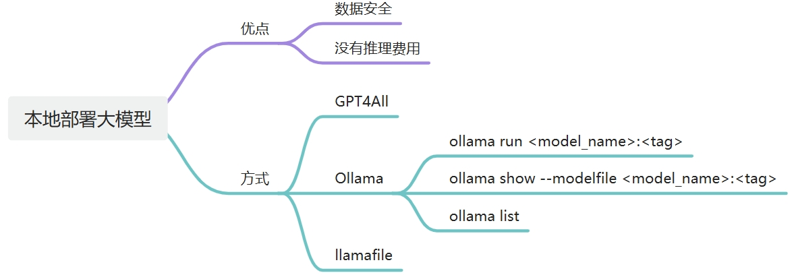

1. gguf：（GPT-Generated Unified Format）为大语言模型设计的二进制文件格式，用于解决大型模型在存储效率、加载速度、兼容性和扩展性方面的问题；
2. 量化：将模型权重的数值从浮点数转换为整数表示的过程。可减少模型内存占用和提高计算效率，同时保持或近似原始模型的精度；
3. RAG：（Retrieval-Augmented Generation）检索增强生成；
4. llama.cpp：纯C/C++编写的大模型推理引擎，使大模型的推理更加简单，并且在各种硬件设备上拥有很好的性能，支持量化以获得更快的推理速度，减小内存的消耗；
5. Cosmopolitan Libc：能够使C成为一次构建、随处运行的语言，就像 Java 一样，不需要解释器或虚拟机。

